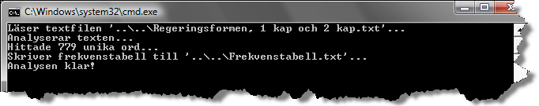
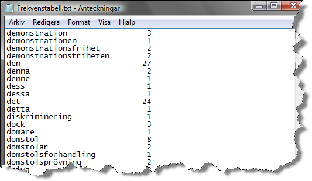

# Lösning

___WordFactory.cs___

Följande är ett förslag på lösning av metoden ```CountWords```:

```c#
using System;
using System.Collections.Generic;

namespace Step3Lab05
{
    static class WordFactory
    {
        private readonly static char[] Separators;

        static WordFactory()
        {
            // Array med tecken som ska betraktas som avskiljare 
            // mellan ord.
            Separators = new char[] { ' ', '\t', '\r', '\n', '.', 
                ',', ':', ';', '?', '!', '=', '/', '(' ,')', 
                '[', ']', '{', '}', '\\', '\'', '"' };
        }

        public static string[] GetWords(string text)
        {
            // Delar upp texten i ord.
            return text.Split(Separators, StringSplitOptions.RemoveEmptyEntries);
        }

        public static IDictionary<string, int> CountWords(string[] words)
        {
            IDictionary<string, int> frequencyTable = new SortedList<string, int>();
            foreach (string word in words)
            {
                if (frequencyTable.ContainsKey(word))
                {
                    ++frequencyTable[word];
                }
                else
                {
                    frequencyTable.Add(word, 1);
                }
            }

            return frequencyTable;
        }
    }
}
```

När metoden _CountWords_ har implementerats korrekt ska en körning av programmet resultera i en textfil med utseende enligt Figur 3.  

___Konsolfönster___


Figur 2. 779 unika ska hittas.


Figur 3. Textfilen _Frekvenstabell.txt_ med alla unika ord och antalet gånger de förekommer.
